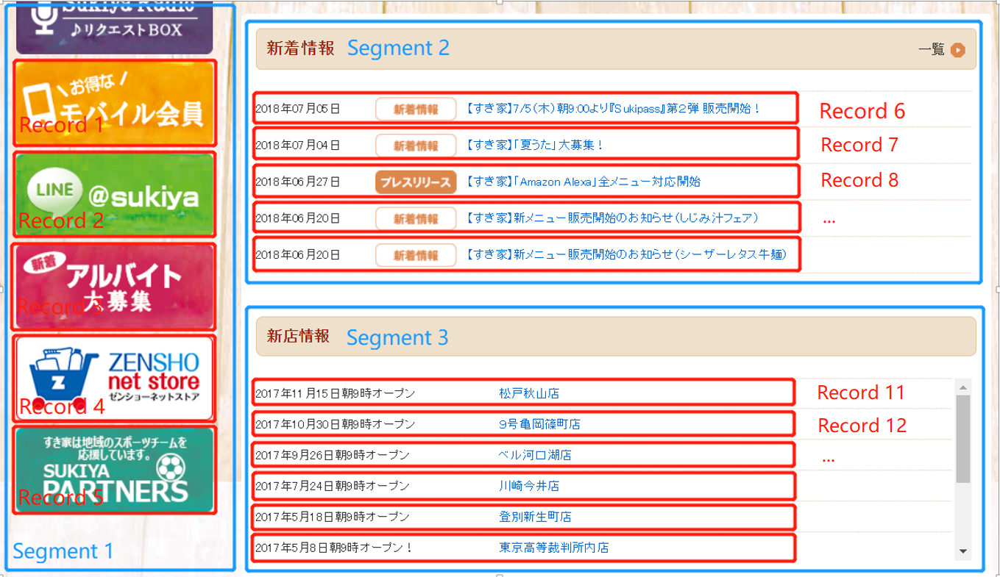

Introduction
======

Data on a webpage are composed of semi-structured data, which cannot be directly processed.
We propose this web segment algorithm, which converts a HTML document into structured data.
Through this algorithm, a HTML document is segmented into "Segments" and "Records" corresponding to "Tables" and "Records" in a structured database, respectively.

As shown in follow, a [webpage](http://www.sukiya.jp/) is segmented into "Segment 1" that contains "Record 1 to 5",
and "Segment 2" that contains "Record 6 to 10", and "Segment 3" that contains "Record 11 to 16".



Corresponding to a database, they should be:

Segment 1:

|  id  |  text  |
| ---- | ---- |
|  1  |  Image(http://www.sukiya.jp/common/img/bnr_sub_contents_member.png) |
|  2  |  Image(http://www.sukiya.jp/common/img/bnr_sub_contents_line.png)  |
|  ...  |  ...  |
|  5  |  Image(http://www.sukiya.jp/common/img/bnr_sub_contents_partner.png)  |

Segment 2:

|  id  |  text  |
| ---- | ---- |
|  6  |  2018年07月05日	 【すき家】7/5（木）朝9:00より『Sukipass』第２弾 販売開始！ |
|  7  |  2018年07月04日	 【すき家】「夏うた」大募集！  |
|  ...  |  ...  |
|  10  |  2018年06月20日 【すき家】新メニュー販売開始のお知らせ（シーザーレタス牛麺）  |

Segment 3:

|  id  |  text  |
| ---- | ---- |
|  11  |  2017年11月15日朝9時オープン	松戸秋山店 |
|  12  |  2017年10月30日朝9時オープン	９号亀岡篠町店 |
|  ...  |  ... |
|  16  | 2017年5月8日朝9時オープン！	東京高等裁判所内店  |


Quick Started
======

- Our Testing Environment (It also can be ran on Linux or Mac)
    - OS: Microsoft Windows 10 Pro
    - Python: 3.6.5
    - Chrome: 67.0.3396.79 (Official Build) (64-bit)
    - Chrome-driver: 2.4

- Clone the code

```bash
$ git clone --recursive https://github.com/liaocyintl/WebSegment.git
```

- Config **setting.py**
    - CHROME_BINARY_LOCATION is the path of Chrome EXE, which we used as the headless brower.
        - Windows: "C:\Program Files (x86)\Google\Chrome\Application\chrome.exe" on default
        - Linux(Ubuntu): should be "/usr/bin/google-chrome" see [here](https://qiita.com/shinsaka/items/37436e256c813d277d6d) for detail
        - Mac OS: should be "/Applications/Google Chrome Canary.app/Contents/MacOS/Google Chrome Canary" see [here](https://duo.com/decipher/driving-headless-chrome-with-python) for detail
    - DRIVER_PATH: You will need to download the ChromeDriver executable from [here](http://chromedriver.storage.googleapis.com/index.html?path=2.4/) corresponding to your OS.

- Try to segment a webpage in the sample code **demo.py**

```python
from segment import Segment
spliter = Segment()
spliter.segment(url="http://www.sukiya.jp/", output_folder="data/sukiya", is_output_images=True)
```

Parameters:

|  Parameter  |  Description  |
| ---- | ---- |
|  url  |  The URL of webpage that you want to segment |
|  output_folder  |  The folder path you want to output segment results  |
|  is_output_images  |  Output web images or not, default 'False' |


Output
========

## result.json

The file result.json in output folder is the main segment result.
```json
{
  "title":"すき家",
  "url":"http://www.sukiya.jp/",
  "segments": [
    {
      "records": [
        {
          "texts": ["すき家"],
          "css_selectors": [
            "html > body:nth-child(2) > div:nth-child(2) > div:nth-child(2) > div > div > div"
          ],
          "links": [
            {
              "href": "http://www.sukiya.jp/"
            }
          ],
          "images": [
            {
              "alt": "",
              "src": "http://www.sukiya.jp/common/img/hd_logo.png",
              "path": "data/sukiya/images/66_0.png",
              "bg_color": "255,255,255"
            }
          ],
          "record_id": 66
        }
      ],
      "segment_id": 13,
      "css_selector": "html > body:nth-child(2) > div:nth-child(2) > div:nth-child(2) > div > div"
    }
  ]
}
```

- title: the title of the webpage
- url: the URL of the webpage
- segments: an array of segments, which contain records.
    - segment_id: an unique ID of this record in result.json
    - css_selector: the CSS selector of this segment (A segment has only one root element)
    - records: an array of records in a segments.
        - record_id: an unique ID of this record in result.json
        - css_selectors: an array of all CSS selectors of all elements in this record (A record may has multiple sibling elements)
        - texts: an array of texts in this record
        - links: an array of hyperlinks in this record
            - href: the 'href' attribute of this link (absolute URL)
        - images: an array of images in this record
            - alt: the 'alt' attribute of this image
            - src: the 'src' attribute of this image (absolute URL)
            - path: the local path where the image is archived to only when set is_output_images to "True"
            - bg_color: the R,G,B background color of the image

## screenshot.png

A screenshot of this webpage.

## images (Folder)
If set "is_output_images" to "True", the folder will be generated.
Web images are saved in it.
The file name is compose as "record id + '_' + seq. in this record".
The path can be found at segments.records.images.path in the result.json.

Some Algorithm Details
========
- Some web images are hidden in the element's background image attribute defined in its Cascading Style Sheets (CSS). 
The crawler scans all nodes in the HTML document and extracts the background image if the node has one. 
- A web image might be a PNG image with a transparent background. 
It relies on the background color of its parent nodes to form part of the color scheme of the logo. 
Therefore, when the crawler finds an image type capable of having transparency, such as a PNG, the crawler then scans all its parent nodes in the proper sequence to locate the one which has the same background color attribute in CSS, and converts the PNG image into JPG with the matching background color. 


## Cite
If you like this work please cite our paper
```text
@article{websegment,
  title={An Event Data Extraction Method Based on HTML Structure Analysis and Machine Learning},
  author={Liao, Chenyi and Hiroi, Kei and Kaji, Katsuhiko and Kawaguchi, Nobuo},
  journal={Computer Software and Applications Conference (COMPSAC)},
  volume={3},
  pages = {217-222},
  year={2015}
}
```